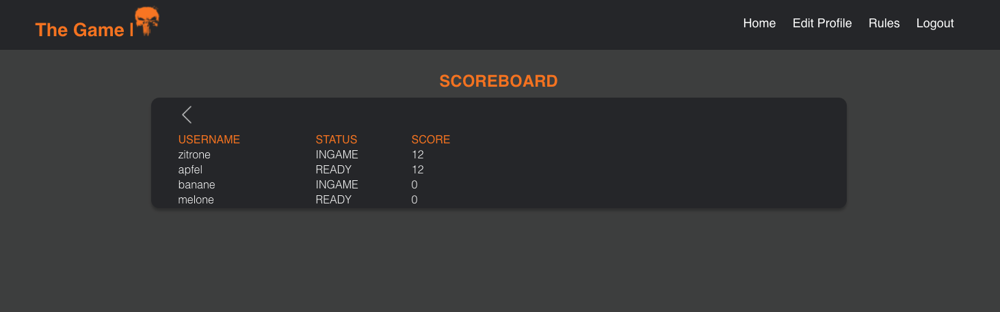
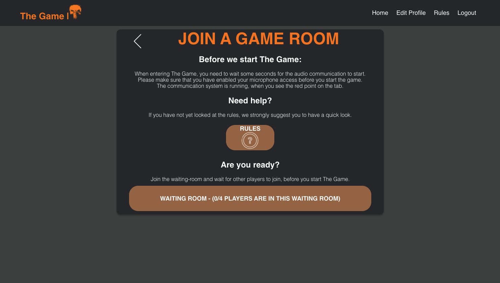
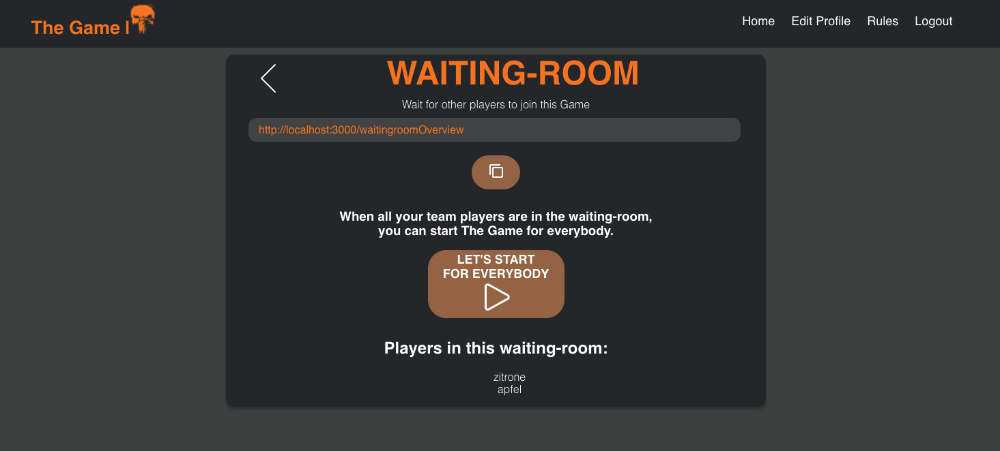
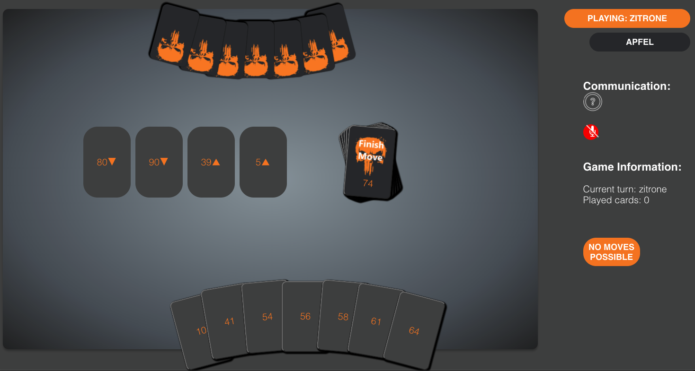

# SoPra FS22 - Client of The Game

## Introduction

The Game is a card game invented by Steffen Benndorf where the Goal is to play all cards on 4 decks in the right order.
The Goal of this software is to be able to play The Game remote and in real time with your friends.

This repository of the Client side of The Game needs two servers to have a running Game ([main server](https://github.com/sopra-fs22-group-11/SoPra22-group11-TheGame-Server) and [Zoom server](https://zoomvideosdk-signature.herokuapp.com/))

The scope of this project is to have a running application and a playable Game, specifically:
- you can login and adjust your profile
- you can wait in a waiting room until your friends have joined 
- in the game, all restrictions from the rules are implemented
- a user is able to leave the game at any time
- the users are able to have a voice call during the Game

Out of scope for this project:
- having a bug free application
- playing different games at the same time
- storing all the users and scores on a separate database

## Technologies

### Client

The client side is written in JavaScript using React and Node.js. For the UI we are using CSS and SCSS.

Tutorials:

- [React documentation](https://reactjs.org/)
- [CSS](https://www.w3schools.com/Css/), [SCSS](https://sass-lang.com/documentation/syntax), and [HTML](https://www.w3schools.com/html/html_intro.asp)
- [react-router-dom](https://reacttraining.com/react-router/web/guides/quick-start) offers declarative routing for React. It is a collection of navigational components that fit nicely with the application. 
- [react-hooks](https://reactrouter.com/web/api/Hooks) let you access the router's state and perform navigation from inside your components.

For requesting data from the server, the client uses two different ways. For the login and user organisation we have a REST Interface.
During the Game we are using a Websocket interface to have a bidirectional communication between client and server. There exist a second server for generating the Zoom signature. This request will be done as an HTTP-request.


### Server

On the Server side we are using Java with bootRun. A detailed description you will find in the [server repository](https://github.com/sopra-fs22-group-11/SoPra22-group11-TheGame-Server)


## High Level components

The following components are essential for the client of The Game:

- [SockClient](https://github.com/sopra-fs22-group-11/SoPra22-group11-TheGame-Client/blob/fcb7b22130a6acfb7d2fc4d163c6ef03ef39810d/src/components/utils/sockClient.js)

- Waiting-room

- Game

- Zoom


One of the most important ones is the SockClient component. It is responsible for the bidirectional communication with the WebsocketController from the [server repository](https://github.com/sopra-fs22-group-11/SoPra22-group11-TheGame-Server).
The subscriptions to the different topics will be done in the components where it is needed (e.g. Game, Waiting-room etc.), but the requests are defined in the [SockClient](src/components/utils/sockClient.js) component.

In order to start The Game together, the players will join a waiting-room and connect in the background with [Websocket](src/components/utils/sockClient.js). This enables the functionalities that we can see who is in the waiting-room and enables us to 
start the Game for all players at the same time. If you leave the waiting-room, the connection to websocket will be ended.

In the game we subscribe to two main channels in websocket: '/topic/game' and '/topic/status'. These two subscriptions will inform us, if another player has done a move and will rerender the UI.
The game view is split into different parts: on the left side we have the Game Board and on the right side we have the communication ([Game CSS](src/styles/views/Game.scss)).
To be able to speak with each other the game view collaborates with the Zoom API.

The [Zoom folder](src/zoom) enables us to speak with each other during the Game. We are using the [Zoom SDK](https://marketplace.zoom.us/docs/sdk/video/introduction).
The whole folder is built from different JavaScript files. The most important ones are the [tool](src/zoom/js/tool.js) and the [button-click-handler](src/zoom/js/meeting/session/button-click-handlers.js).
The [tool](src/zoom/js/tool.js) component will send a signature request to our [Zoom server](https://zoomvideosdk-signature.herokuapp.com/), which enables the client to join the zoom call.


## Launch & Deployment

For your local development environment, you will need Node.js. You can download it [here](https://nodejs.org). All other dependencies, including React, get installed with:

```npm install```

To run the app use:

`npm run dev`
  
It will open the app in [http://localhost:3000](http://localhost:3000) in your default browser

Deployment will be done with [CLI](https://devcenter.heroku.com/articles/heroku-cli) from Heroku.
When you are logged in you can run:

`git heroku push master`

The application will be deployed. Find more about it [here](https://stackoverflow.com/questions/71892543/heroku-and-github-items-could-not-be-retrieved-internal-server-error).


## Illustrations

Before you can enter The Game you need to register or login. 


After that you will be redirected to the startpage where you have different options. You can see the rules, check the scores, edit your profile
or play a game.


When clicking on "Let's play" you will be redirected to the waitingroom overview, where you can click a button to join the waitingroom, if it is not full yet.



As soon as enough players have joined the waiting-room, someone can click on "Let's start for everybody", and everyone is forwarded to the game.


In the game, they can see all their cards displayed in front of them. You can also see how many cards the other players have. In the 
middle there are the four piles and the draw pile. When clicking on one of your cards, the card is selected and you can choose on which pile 
you want to play it.


When The Game is won, it will finish automatically and you will see that 100 points will be added to your score.


You can decide if you want to play again or leave. When leaving you will be redirected to the start page.


## Roadmap

As described above, there are some features which are not in the scope of this project. The following features can be added to the tool:
- playing different games at the same time
- storing all the users and scores on a separate database 
- add another voice API which is not chargeable

We give thanks in advance to all the voluntary developers who have fun to improve our Game. Please make sure to tag us :)

## Authors and acknowledgment

Authors of this project:
- [Najma Christen](https://github.com/najma98)
- [Sandra Rosch](https://github.com/Saro7890)
- [Marinja Principe](https://github.com/Mariinja)
- [Deborah Stebler](https://github.com/Desteb)
- [Tijana Kostovic](https://github.com/tikost)

We thank the whole TA Team of the SoPra 2022 course which helped us during the creation on this project and our TA Jan Kreischer for supporting us.
> A Special thanks to Lucas Pelloni and Kyrill Hux for working on the template and answering our questions.

## License 

This project is licensed under [Apache-2.0](LICENSE).
